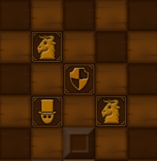
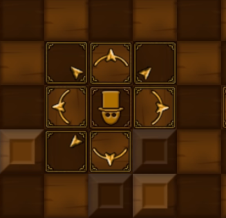
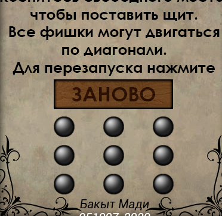

# Devil game
Курсовая работа по ОАиП, гр. 951007, Бакыт Мади, 2019, БГУИР, Минск
## Правила
В этой игре необходимо спасти человека от демонов. В игре есть 9 уровней и чтобы пройти игру, нужно пройти их всех. Защищайте человека от демонов прячась в укрытиях и/или делая укрытия самим!
## Управление
1. Нажмите в любое свободное место на поле, чтобы поставить <strong>щит</strong>  
  
2. Нажмите на человека, чтобы выбрать направление <strong>движения</strong>  
  
3. Нажмите на кнопку перезагрузки, чтобы начать уровень <strong>заново</strong>  
  
Удачной игры!
## Отчет
Отчет курсовой можно посмотреть [тут](./report.docx)